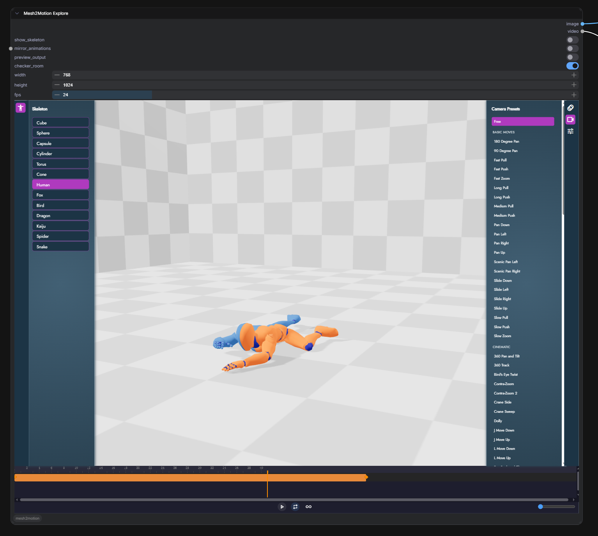
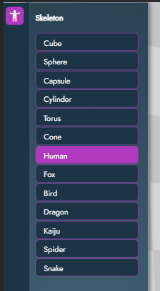
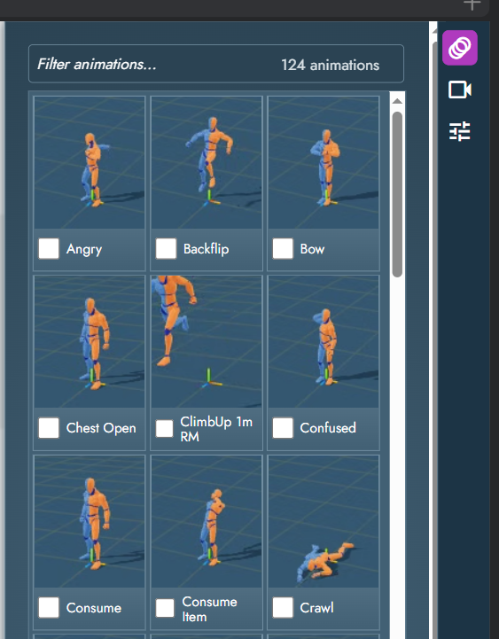
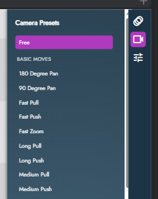
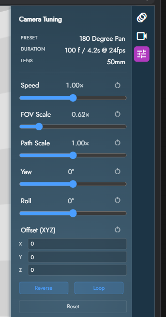
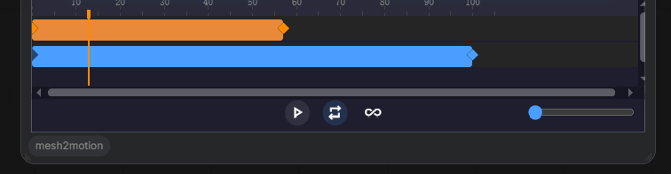

# ComfyUI-mesh2motion

<div align="center">

English | [简体中文](./README_CN.md)

</div>

A ComfyUI custom node that embeds a heavily-modified fork of
[Mesh2Motion](https://mesh2motion.org) as an interactive 3D editor
directly inside a node. Pick a rig, pick a camera move, tune the shot,
and the node emits an `IMAGE` (single frame) + `VIDEO` (rendered
camera move) that flow into the rest of your ComfyUI graph.

https://github.com/user-attachments/assets/11b87a68-32d7-45ba-b59c-4a6bb950310b

---

## What changed vs. upstream

This is a deep rework of the original plugin. If you used an earlier
version, expect the following:

- **One primary node.** Node-embedded editing routes through a single
  `Mesh2Motion Explore` node; the old `Create` / `Preview` / `Save`
  variants are gone.
- **Right-click / top-menu open a separate "window" editor.** The
  lightweight dialog path is back (1.1.0+) but it now loads its own
  pages (`index-comfyui-window.html` / `create-comfyui-window.html`),
  kept off the node-mode code path so the two never fight over DOM /
  bridge state. No Vue / PrimeVue runtime anymore — plain DOM modal.
- **All node-mode UI moved into the iframe.** Skeleton picker, camera
  preset browser, tuning controls, timeline — every control the user
  needs is inside the embedded editor.
- **Full state persistence.** Everything the user picks or tunes is
  saved inside `node.properties`, so reloading the workflow restores
  the exact shot.
- **Video output is first-class.** The node outputs a `VIDEO`
  directly (webm decoded server-side via PyAV), no separate frame-list
  node needed.

---

## Installation

```bash
cd ComfyUI/custom_nodes
git clone https://github.com/jtydhr88/ComfyUI-mesh2motion.git
```

Restart ComfyUI. No extra Python dependencies — everything else is
either bundled or already in ComfyUI.

---

## The Mesh2Motion Explore node



### Widgets

| Widget | Type | Purpose |
|---|---|---|
| `show_skeleton` | bool | Draws the bone helper on top of the mesh |
| `mirror_animations` | bool | Mirrors the animation around the rig's symmetry plane |
| `preview_output` | bool | Overlays a crop rectangle matching `width`/`height` so you can see what'll actually be captured |
| `checker_room` | bool | Wraps the scene in a checkered room for more "AI-friendly" rendering |
| `width` / `height` | int | Output resolution for both IMAGE and VIDEO |
| `fps` | int | Frame rate written into the VIDEO (the timeline plays at the preset's native cadence; this only sets the encoded rate) |

### Outputs

| Output | When it's filled |
|---|---|
| `IMAGE` | Always — one screenshot of the viewport at the current playhead position |
| `VIDEO` | When a camera preset is active — a rendered webm of the whole camera move |

---

## Usage guide

### 1. Drop the node and open the editor

Add `Mesh2Motion Explore` from the node menu (category `3d/mesh2motion`).
The node renders an interactive 3D editor in place — no separate window
or modal.

### 2. Pick a skeleton (left side)



The left **activity bar** has a button that opens the **Skeleton** panel.
Two sections:

- **Primitives** — cube, sphere, capsule, cylinder, torus, cone. Useful
  for testing a camera path without loading a character, or for
  background elements.
- **Character rigs** — Human, Fox, Bird, Dragon etc. Each rig ships
  with a set of compatible animations.

Selecting a character loads its rig, its default mesh, and its animation
library (right panel → Animations).

### 3. Pick an animation (right side → Animations)



Opens via the right activity bar's first button. Animations are filtered
to the active skeleton type. Clicking one loads it into the mesh and
adds an animation track on the timeline.

### 4. Pick a camera preset (right side → Camera Presets)



Second button on the right activity bar. **116 presets** across 8
intent-based categories:

- **Basic Moves** — pans, slides, straight pushes/pulls, zooms
- **Cinematic** — dolly, crane, 360 track, J/L moves, Bird's Eye
- **Handheld** — handheld static/transitions, handheld zooms, subtle look-around
- **Speed Ramps** — dramatic accelerating moves (push/pull/twist)
- **Locomotion** — walking, running (forwards / backwards / sideways)
- **Vehicle** — car flybys, jet overpass, helicopter flyover, drone
- **Action** — missile strike, explosion, gunfire, flinch, fall
- **Abstract** — space cam floating, spinning, drunk

Clicking a preset immediately starts the camera move. Click **Free**
at the top to go back to free orbit controls (no preset active).

### 5. Tune the preset (right side → Camera Tuning)



Third button on the right activity bar. When a preset is active, the
panel shows the preset's metadata and a set of tuning controls.

**Metadata (read-only)**
- Preset name
- Duration (frames / seconds @ fps)
- Lens range — a ⚡ marker means the preset animates its lens mid-shot
  (Contra-Zoom / Dolly-Zoom class)

**Tuning controls**

| Control | What it does | Default |
|---|---|---|
| **Speed** | Playback speed multiplier (0.25× – 4×) | 1× |
| **FOV Scale** | Multiplies every frame's focal length; > 1 narrows FOV (zoom in) | 1× |
| **Path Scale** | Scales the whole camera path around the subject. < 1 = closer to subject, > 1 = further out. Baked rotations stay valid because the camera→subject direction is preserved | 1× |
| **Yaw** | Rotates the path around the vertical axis through the subject. Turns "dolly from the front" into "dolly from the side" | 0° |
| **Roll** | Dutch angle — rotates the camera around its own forward axis | 0° |
| **Offset (XYZ)** | Rigid world-space translation added to every frame's position (Three.js Y-up). Rotations are left untouched | (0, 0, 0) |
| **Reverse** | Play the preset backwards | off |
| **Loop** | Mirror of the timeline's loop toggle — kept in sync automatically | on |

Each control has an inline **↻** button that resets just that control.
The **Reset** button at the bottom clears everything.

Tuning is persisted **per preset** — picking the same preset later in
the same workflow restores the tuning you had.

### 6. Work with the timeline



- **Camera track (blue)** — the active preset's range. Right endpoint
  (solid blue) is draggable; drag it to change playback speed. Left
  endpoint (washed-out blue) is fixed at frame 0.
- **Animation track (orange)** — the active model animation. Drag the
  whole bar to shift the animation offset within the timeline. Drag
  the left or right endpoint to change speed.
- **Playhead** — drag across the timeline to scrub, or click anywhere
  to jump.

Playback bar below the timeline:

| Control | Purpose |
|---|---|
| ▶ / ❚❚ | Play / pause |
| 🔁 Timeline Loop | When the playhead hits the end of the camera range, restart from start. When off, playback pauses at the end |
| ♾ Model Anim Loop | When on, the animation keeps looping inside its range. The timeline visualization tiles the animation bar across the full camera length — solid orange for the authored cycle, washed-out orange for loop copies |
| Zoom slider | Zooms the timeline horizontally (also supported via Ctrl + wheel on the timeline) |

### 7. Set the output size and queue

Set `width`, `height`, `fps` on the node. Click Queue Prompt. The node
produces:

- `IMAGE` — a single frame at the current playhead
- `VIDEO` — the whole camera move, rendered off-screen at the target
  resolution

The video capture is cached: re-queuing without changing any input
that affects the captured frames short-circuits the render, so repeat
runs are instant.

#### Video encoder: WebCodecs vs MediaRecorder fallback

The editor records video with WebCodecs `VideoEncoder` by default —
it's deterministic (frame-by-frame from the WebGL backing buffer, no
compositor round-trip) and materially faster than any alternative in
the browser. When it's available, use it.

`VideoEncoder` is missing in some environments though, so the editor
automatically falls back to a `MediaRecorder` path on the same canvas.
Known cases where the fallback kicks in:

- **Safari < 17** — `VideoEncoder` shipped in Safari 17.
- **Older Firefox** — WebCodecs encode is recent on Firefox (130+).
- **Non-secure contexts on some browsers** — e.g. serving ComfyUI over
  HTTP on a LAN IP like `http://192.168.x.x:8188`. Localhost and
  `127.0.0.1` are Secure Contexts so WebCodecs works there. HTTPS or
  localhost is the fix.

The fallback produces the same webm (same resolution, same frame
count, same fps) but is noticeably slower because each frame has to
round-trip through the browser compositor before it reaches the
recorder. **If video recording feels slow, that's why** — check the
list above and, if possible, switch to HTTPS or run ComfyUI on
localhost to get the WebCodecs path back.

---

## Window mode (right-click / top-menu)

Not every workflow is best served by an in-node iframe — sometimes you
just want the full editor on top of the graph to sketch a pose or
grab a reference render. Window mode opens Mesh2Motion as a modal
dialog over ComfyUI and, on close, pushes the result back into a
ComfyUI node as if you had uploaded it yourself. It doesn't add
anything to the workflow graph — it's a one-shot editor interaction.

### Entry points

- **Top-menu `Mesh2Motion` button.** Appended to the ComfyUI menu's
  settings group. Opens the Explore page.
- **Right-click → "Open in Mesh2Motion".**
  - On `LoadImage`: opens the Explore page. Image saved from the
    dialog lands back on this node.
  - On `Load3D` / `Preview3D` / `SaveGLB` (and any other node whose
    widget is holding a `.glb` / `.gltf` / `.fbx` / `.obj`): opens
    the Create page pre-loaded with that node's model.

### Dialog chrome

The header of the modal has four things:

- **Title** — shows whether you're in Explore or Create.
- **Status line** — loading/export progress and error messages.
- **Save Image** — triggers an image export (Explore flow).
- **Save Model** — triggers a GLB export (Create flow).
- **✕** — close without saving. Clicking the dimmed area around the
  modal has the same effect.

### Explore flow: rig + animation → image back to LoadImage

1. Open the dialog from the top-menu `Mesh2Motion` button, or by
   right-clicking a `LoadImage` node.
2. Pick a character rig from the left-side model list (Human, Fox,
   Bird, Dragon).
3. Pick an animation from the right-side list. The playback bar at
   the bottom lets you scrub to any frame.
4. Position the camera with the mouse (left-drag = orbit, right-drag
   = pan, wheel = zoom).
5. Click **Save Image**. A crop overlay opens inside the iframe —
   drag the crop box / resize to frame your shot, then confirm.
6. The PNG is uploaded into ComfyUI's `input/mesh2motion/` folder,
   and its path is written into the originating `LoadImage` widget
   (or the first `LoadImage` on the graph, if you opened the dialog
   from the top-menu button). The node's preview thumbnail refreshes
   immediately.

### Create flow: rig a 3D model → GLB back to the source node

1. Right-click a node holding a 3D model (`Load3D`, `Preview3D`,
   `SaveGLB`, or any node whose widget value ends in `.glb` /
   `.gltf` / `.fbx` / `.obj`).
2. The dialog opens on the Create page with your model pre-loaded.
   If you prefer to start from scratch, use the top-menu `Mesh2Motion`
   button instead and navigate to Create from the in-dialog nav.
3. Rotate the model to face front (`X` / `Y` / `Z` buttons), raise
   it onto the floor if needed, and pick a skeleton template that
   matches its anatomy.
4. Step into **Edit Skeleton**: drag each bone into place. Use the
   Preview toggle to flip between textured and weight-painted
   previews, and mirror left/right joints with the checkbox.
5. **Bind pose** to commit the skeleton, then pick animations from
   the list. A-pose correction and per-animation selection are in
   the right panel.
6. Click **Save Model**. The rigged + animated GLB is uploaded into
   ComfyUI's `input/mesh2motion/` folder, and the originating node's
   widget picks up the new path automatically.

### Implementation note

Window mode runs on deliberately separate pages from the node-embedded
editor (`index-comfyui-window.html` / `create-comfyui-window.html`),
so the two paths never share DOM hooks or bridge state. The dialog
talks to the iframe through a small `comfyui:*` postMessage protocol
(`loadModel` / `requestExport` / `requestImageExport` / `setTheme`).

---

## Changelog

### 1.1.0 — 2026-04-22

- **Window mode restored.** Right-click `LoadImage` / `Load3D` /
  `Preview3D` / `SaveGLB` → "Open in Mesh2Motion" opens a lightweight
  vanilla-DOM modal (no Vue / PrimeVue dependency). A `Mesh2Motion`
  button also lives on the ComfyUI top menu. Runs on its own
  `*-comfyui-window.html` pages so node mode and window mode never
  share state.
- **MediaRecorder fallback for video capture.** The editor
  auto-falls-back to `MediaRecorder` when `WebCodecs.VideoEncoder`
  isn't available (Safari < 17, older Firefox, non-secure contexts
  such as ComfyUI over HTTP on a LAN IP). Slower than WebCodecs but
  video output now works everywhere `MediaRecorder` does.
- **Video cache signature picks up all tune-panel edits.** Changing
  FOV Scale / Reverse / Path Scale / Yaw / Roll / XYZ Offset now
  correctly invalidates the cached webm so the next Queue re-renders.
  Previously only Speed was honored (it rides on the timeline entry);
  the other knobs were silently ignored and returned stale video.

### 1.0.0

- Converted from a multi-node + Vue-dialog layout into a single
  `Mesh2MotionExplore` node with an embedded iframe.
- Full state persistence via `node.properties` — skeleton, camera
  preset, per-preset tuning, timeline state, panel open/closed,
  timeline zoom.
- First-class `VIDEO` output with WebCodecs deterministic recording,
  user-settable `fps`, and input-hash caching that skips re-render
  when inputs haven't changed.
- Camera preset pack bundled into the build (116 presets across 8
  intent-based categories) with a tuning panel (Speed / FOV Scale /
  Path Scale / Yaw / Roll / Offset / Reverse / Loop).

---

## License

MIT

## Credits

- [Mesh2Motion](https://mesh2motion.org) by Scott Petrovic — the
  original 3D rigging and animation tool this plugin builds on
- [ComfyUI](https://github.com/comfyanonymous/ComfyUI) — the workflow
  platform
- [animation-timeline-js](https://github.com/ievgennaida/animation-timeline-control)
  — the canvas-based timeline widget
